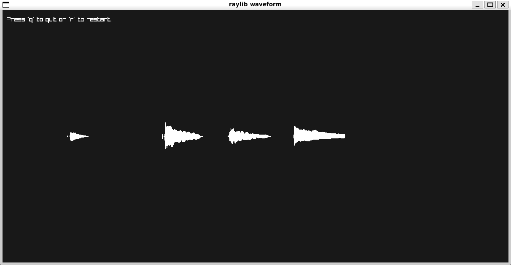
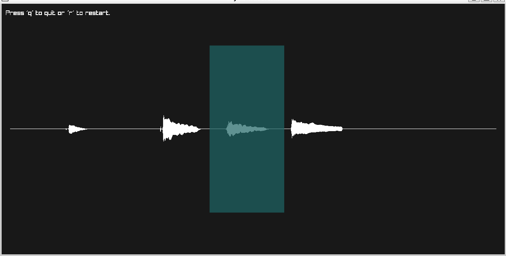
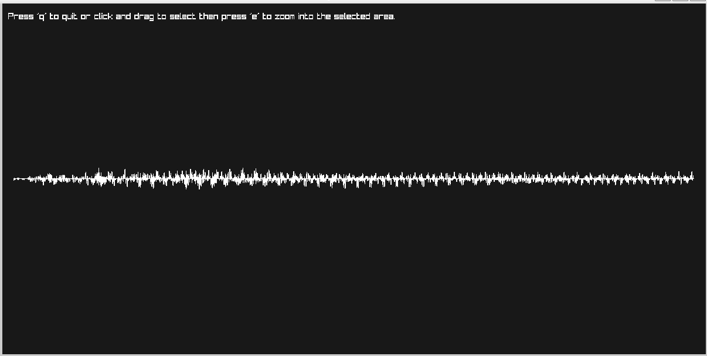

# Audio Visualizer

With this program you can visualize the waveform of an audio file.

Firstly the program opens this window with the waveform.

We can select a region we want then press 'e'

Now we see the zoomed in region of the selected area
